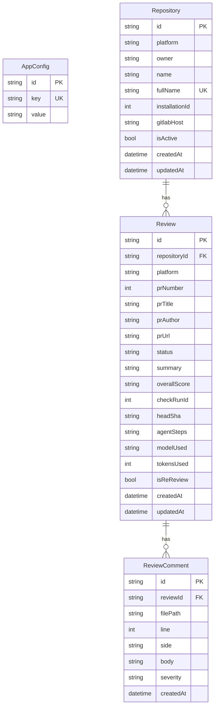

# Architecture

CodeSentinel is a self-hosted, AI-driven code review tool for GitHub and GitLab. It listens for pull request / merge request webhook events, runs a multi-turn chat completion loop against a configurable AI backend, validates the output against the actual diff to prevent hallucinations, then posts structured inline review comments back to the platform.

---

## System Overview

```
┌──────────────────────────────────────────────────────────────────┐
│                        CodeSentinel                               │
│                                                                   │
│  ┌─────────────┐     ┌──────────────────┐    ┌────────────────┐  │
│  │  Dashboard   │     │  API Routes      │    │  Webhook       │  │
│  │  (React SPA) │◀───▶│  /api/config     │◀───▶│  /api/webhook  │  │
│  │              │     │  /api/reviews    │    │  /api/webhook/ │  │
│  │              │     │  /api/trigger    │    │    gitlab      │  │
│  └──────────────┘     └────────┬─────────┘    └───────┬────────┘  │
│                                │                       │          │
│                                ▼                       ▼          │
│                     ┌─────────────────────────────────────┐       │
│                     │      Review Engine (reviewer.ts)     │       │
│                     │                                     │       │
│                     │  ┌───────────────────────────────┐  │       │
│                     │  │  Agent Loop                   │  │       │
│                     │  │ ┌──────┐ ┌────────┐ ┌──────┐ │  │       │
│                     │  │ │Analyze│ │Investi-│ │Review│ │  │       │
│                     │  │ │       │ │gate    │ │      │ │  │       │
│                     │  │ └───────┘ │(tools) │ └──────┘ │  │       │
│                     │  │           └────────┘          │  │       │
│                     │  └───────────────────────────────┘  │       │
│                     │                                     │       │
│                     │  ┌───────────────────────────────┐  │       │
│                     │  │  Hallucination Guard          │  │       │
│                     │  │  validateReviewAgainstDiff()  │  │       │
│                     │  └───────────────────────────────┘  │       │
│                     │                                     │       │
│                     │  ┌───────────────────────────────┐  │       │
│                     │  │  AI Provider Layer            │  │       │
│                     │  │  z-ai-sdk | OpenAI-compatible │  │       │
│                     │  └───────────────────────────────┘  │       │
│                     └─────────────┬───────────────────────┘       │
│                                   │                               │
│                     ┌─────────────▼───────────────────────┐       │
│                     │         GitHub / GitLab API          │       │
│                     │  ┌──────────┐   ┌────────────────┐  │       │
│                     │  │  github  │   │    gitlab      │  │       │
│                     │  │  .ts     │   │    .ts         │  │       │
│                     │  └──────────┘   └────────────────┘  │       │
│                     └────────────────────────────────────┘       │
│                                                                   │
│  ┌──────────────────────────────────────────────────────────┐    │
│  │                 Prisma + SQLite                           │    │
│  │  AppConfig │ Repository │ Review │ ReviewComment          │    │
│  └──────────────────────────────────────────────────────────┘    │
└──────────────────────────────────────────────────────────────────┘
```

---

## Core Execution Flow

### Webhook → Review → Post

```mermaid
sequenceDiagram
    participant GH as GitHub
    participant WH as Webhook Route
    participant RL as Rate Limiter
    participant DB as Prisma/SQLite
    participant AI as AI Provider
    participant RE as Review Engine

    GH->>WH: POST /api/webhook (pull_request.opened)
    WH->>RL: checkRateLimit(ip)
    RL-->>WH: ok

    WH->>DB: findUnique(webhook_secret)
    DB-->>WH: secret
    WH->>WH: verifySignature (HMAC-SHA256 timing-safe)

    WH->>DB: isDuplicateDelivery(x-github-delivery)
    DB-->>WH: new / dedup

    WH->>DB: upsertRepository()
    WH->>DB: createReview(status: reviewing)

    WH->>GH: createCheckRun(in_progress)

    par fetch context
        WH->>GH: fetchPRDiff()
        WH->>GH: fetchPRInfo()
    end

    rect rgb(240, 240, 255)
        Note over RE,AI: Agent Loop (maxSteps iterations)
        loop Each turn
            RE->>AI: chatCompletion(messages)
            AI-->>RE: content (JSON or text)
            RE->>RE: parseReviewFromContent()
            alt tool_call detected
                RE->>RE: executeTool(name, params)
                RE->>RE: inject result → messages
            else final_review detected
                RE->>RE: validateReviewAgainstDiff()
                RE->>RE: buildReviewResult()
                break
            end
        end
    end

    WH->>DB: updateReview(status: completed)
    WH->>DB: createMany(ReviewComment)

    WH->>GH: postPRReview(comments)
    WH->>GH: updateCheckRun(completed, conclusion)
    GH-->>WH: accepted
```

### Component Responsibilities

| Component | File | Responsibility |
|-----------|------|:---------------|
| Webhook Route | `src/app/api/webhook/route.ts` | HMAC verification, delivery dedup, event dispatch, process orchestration |
| Webhook Route (GitLab) | `src/app/api/webhook/gitlab/route.ts` | Token auth, MR event dispatch, slash command handling |
| Review Engine | `src/lib/reviewer.ts` | Agent loop, tool execution, hallucination guard, output building |
| GitHub API | `src/lib/github.ts` | JWT auth, PR diff/info fetch, review posting, check runs |
| GitLab API | `src/lib/gitlab.ts` | Token auth, MR change/diff fetch, discussion/note posting |
| Auth | `src/lib/auth.ts` | JWT sessions, password hashing (scrypt), cookie management |
| Rate Limiter | `src/lib/rate-limit.ts` | DB-backed sliding window, lazy cleanup, IP-based |
| Queue | `src/lib/queue.ts` | DB-backed persistent job queue with retry (see limitations) |
| Secrets | `src/lib/secrets.ts` | AES-256-GCM encrypt/decrypt, key derivation, pattern detection |
| Validation | `src/lib/validation.ts` | Input sanitization, PR number/URL/file path validation |
| Logger | `src/lib/logger.ts` | Structured JSON (prod) / pretty (dev), context propagation |
| Review Timeout | `src/lib/review-timeout.ts` | Promise timeout wrapper, stuck review cleanup scheduler |
| Constants | `src/lib/constants.ts` | Magic numbers, limits, timeouts |

---

## Data Model



### AppConfig Keys

The `AppConfig` table is a key-value store. Known keys:

| Key | Purpose | Sensitive |
|-----|---------|-----------|
| `github_token` | GitHub PAT fallback | Yes |
| `github_app_id` | GitHub App ID | No |
| `github_app_private_key` | GitHub App PEM key | Yes |
| `webhook_secret` | HMAC signing key | Yes |
| `gitlab_token` | GitLab PAT | Yes |
| `gitlab_host` | GitLab instance URL | No |
| `gitlab_webhook_secret` | GitLab webhook auth | Yes |
| `ai_provider` | AI backend selector (`z-ai` / `openai-compatible`) | No |
| `ai_model` | Model identifier | No |
| `ai_api_key` | AI provider API key | Yes |
| `ai_base_url` | OpenAI-compatible base URL | No |
| `ai_temperature` | Sampling temperature (0.0–1.0) | No |
| `ai_max_steps` | Max agent loop iterations (1–10) | No |
| `block_merge` | Enable merge blocking via Check Runs | No |
| `ignore_patterns` | Glob patterns for file exclusion | No |
| `admin_password_hash` | scrypt-hashed admin password | Yes |
| `jwt_secret` | Auto-generated HS256 signing key | Yes |
| `encryption_key` | AES-256-GCM master key | Yes |

---

## Security Boundaries

```
                        ┌─────────────────────┐
                        │   Internet           │
                        │                      │
                        │  ┌──────────────┐   │
                        │  │ Webhook POST  │   │
                        │  │ GitHub/GitLab │   │
                        │  └──────┬───────┘   │
                        │         │            │
                        │         ▼            │
                        │  ┌──────────────┐   │
                        │  │ HMAC-SHA256  │   │
                        │  │ or Token     │◀──┼── Signing secret (DB)
                        │  │ Verification │   │
                        │  └──────┬───────┘   │
                        │         │            │
                        │         ▼            │
                        │  ┌──────────────┐   │
                        │  │ Delivery ID  │   │
                        │  │ Dedup        │   │
                        │  │ (5min window)│   │
                        │  └──────┬───────┘   │
                        │         │            │
                        │         ▼            │
                        │  ┌──────────────┐   │
                        │  │ Rate Limit   │   │
                        │  │ (DB-backed)  │   │
                        │  └──────┬───────┘   │
                        │         │            │
                        │         ▼            │
                        │  ┌──────────────┐   │
                        │  │  Processing  │   │
                        │  │  ✓ DB writes │   │
                        │  │  ✓ AI calls  │   │
                        │  │  ✓ GitHub API│   │
                        │  │    calls     │   │
                        │  └──────────────┘   │
                        │                      │
                        │  Dashboard API       │
                        │  ┌──────────────┐   │
                        │  │ requireAuth  │   │
                        │  │ JWT session  │◀──┼── Cookie (HttpOnly)
                        │  │ verification │   │
                        │  └──────────────┘   │
                        └─────────────────────┘
```

**Trust boundaries:**
- Webhook payloads are **not trusted** until signature is verified
- Dashboard API requests are **not trusted** until JWT session is validated
- AI provider responses are **not trusted** — diff validation checks for hallucinations
- User-provided file paths in tool calls are validated against path traversal
- Config keys are validated against an allowlist

---

## Operational Concerns

### Scalability Bottlenecks

1. **SQLite** — Single-writer. Under high webhook volume (>100 concurrent PR events), Prisma write contention on `AppConfig` (rate limiting, delivery dedup) becomes the first bottleneck. Mitigation: the rate limiter fails open; delivery dedup is best-effort.

2. **AI Backend Latency** — Each review takes 5-30+ seconds depending on model and tool calls. During that time, the webhook handler returns immediately but the process runs in a fire-and-forget promise. In serverless, this can timeout after the platform limit (e.g., Vercel 60s / Netlify 10s).

3. **In-process Queue** — The job queue (`src/lib/queue.ts`) stores jobs in the `Review` table with `repositoryId: 'queue'`. This is a pragmatic shortcut: no separate queue infrastructure, no worker processes, no backpressure. Under sustained load, the queue is a `SELECT` → `UPDATE` polling loop.

4. **Token Tracking** — Token counts are accumulated per step but never persisted in a separate analytics table. No token cost tracking or budget enforcement.

### Failure Modes

| Scenario | Behavior | Recovery |
|----------|----------|----------|
| AI provider times out | Review marked `failed` via `withTimeout()` | Stuck review cleanup catches missed cases |
| GitHub API returns 401 | Token refresh attempted; review fails if auth chain broken | Manual re-configuration |
| Webhook delivered twice | Dedup via `x-github-delivery` (5-min window) | Automatic |
| Process dies mid-review | Review stays in `reviewing` status | `cleanupStuckReviews()` resets on next start |
| Rate limit DB unavailable | Request passes through (fail open) | No recovery needed |
| AI returns invalid JSON | Force prompt on last step → fallback to generic comment | Data loss on specific comments |

---

## Key Design Decisions

### Why SQLite?

SQLite was chosen for zero-operational-overhead deployments. The app needs no database server, no connection pooling, no migrations on upgrade. For single-instance deployments (Docker, Railway, Fly.io), SQLite is sufficient.

**Tradeoff:** No horizontal scaling. If the app needs to run multiple instances behind a load balancer, SQLite must be replaced with PostgreSQL. The Prisma ORM makes this a config change (`provider = "postgresql"`), but the rate limiting and delivery dedup logic assumes a single-writer.

### Why Fire-and-Forget?

The webhook handler returns `202 Accepted` immediately after validating the request, then processes the review asynchronously. This is necessary because GitHub expects webhook endpoints to respond within 10 seconds, but AI reviews can take 30+ seconds.

**Tradeoff:** If the process crashes mid-review, the review is lost (stuck in `reviewing`). The stuck review cleanup and queue module mitigate this but don't eliminate it.

### Why Not a Queue?

No external queue (Redis, SQS, BullMQ) was added to keep the zero-dependency deployment model. The built-in `queue.ts` module uses the SQLite database as a job store.

**Tradeoff:** No persistence guarantees, no dead-letter queues, no visibility into queue depth.

---

## Future Architecture Paths

The current architecture supports these upgrades without major rework:

1. **PostgreSQL swap** — Change Prisma provider + `DATABASE_URL`. Rate limiting and delivery dedup logic is already Prisma-generic.
2. **External job queue** — Replace the in-process polling with RabbitMQ/Redis/Google PubSub. The `processQueue()` function is the integration point.
3. **Webhook payload validation** — Signature verification is already separated from processing logic.
4. **Multi-tenant** — The `Repository` model already has `owner`/`name` fields. Adding org-scoped auth is additive.
