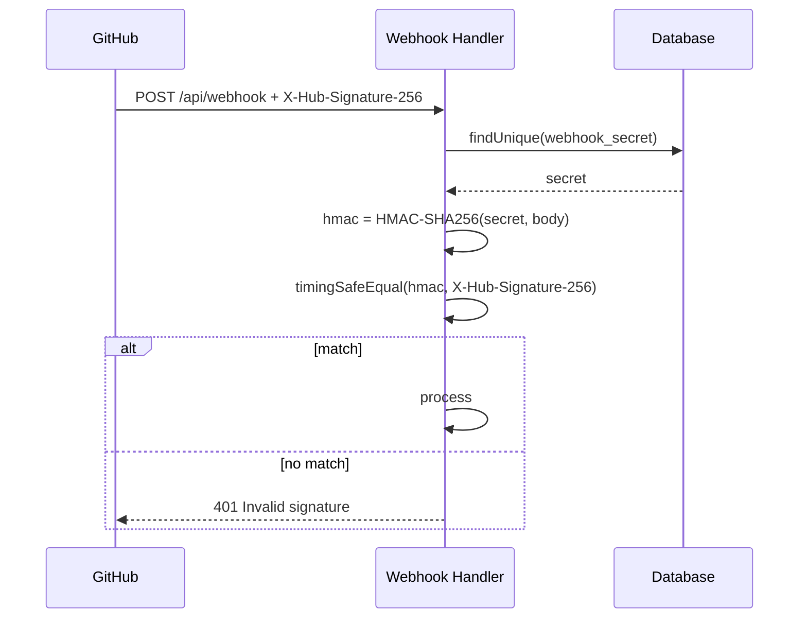

# Security

This document describes CodeSentinel's security architecture, threat model, and operational security considerations.

---

## Threat Model

### Trusted Components

| Component | Trust Level | Rationale |
|-----------|-------------|-----------|
| SQLite database | Full | Local file, no network exposure |
| Dashboard UI | Authenticated | JWT session required for all state-changing operations |
| AI provider API | Partial | Response is validated against diff before use |

### Untrusted Inputs

| Input | Risk | Mitigation |
|-------|------|------------|
| GitHub webhook payload | Forged request could trigger fake reviews | HMAC-SHA256 signature verification |
| GitLab webhook payload | Same as above | Token comparison with `timingSafeEqual` |
| AI provider response | Could return arbitrary JSON with valid schema | Hallucination guard validates against actual diff |
| User file paths in tool calls | Path traversal attacks | Reject paths with `..`, leading `/`, null bytes |
| Slash command arguments | XSS, injection attacks | Input sanitization via `sanitizeString()` |
| Configuration values via API | Injection into DB | Key whitelist (15 allowed keys), value length limits |

### Security Boundaries

```
Internet
  │
  ├── POST /api/webhook ─── HMAC verification (secret from DB)
  ├── POST /api/webhook/gitlab ─── Token verification (secret from DB)
  │
  └── All other API routes ─── JWT session verification (cookie)
         │
         └── Dashboard pages ─── Middleware cookie check → "cs-session"
```

All sensitive data flows through API routes that enforce authentication. The middleware provides UX-level protection (redirect to login page), while `requireAuth()` provides enforcement in each route handler.

---

## Webhook Signature Verification

### GitHub (HMAC-SHA256)



Implementation at `webhook/route.ts:16-26`:

```typescript
function verifySignature(payload: string, signature: string, secret: string): boolean {
  const expectedSignature = 'sha256=' + crypto.createHmac('sha256', secret).update(payload).digest('hex');
  if (!signature || signature.length !== expectedSignature.length) return false;
  return crypto.timingSafeEqual(Buffer.from(signature), Buffer.from(expectedSignature));
}
```

**Fail-secure behavior:** If no `webhook_secret` is configured, ALL webhook requests are rejected with 401 (`webhook/route.ts:315-318`). The service will not operate without this secret.

### GitLab (Token Comparison)

Implementation at `webhook/gitlab/route.ts:11-18`:

```typescript
function timingSafeTokenCompare(a: string, b: string): boolean {
  if (a.length !== b.length) return false;
  return crypto.timingSafeEqual(Buffer.from(a), Buffer.from(b));
}
```

Same fail-secure: requests are rejected if `gitlab_webhook_secret` is not configured.

---

## Authentication

### Dashboard Sessions (JWT HS256)

```mermaid
sequenceDiagram
    participant U as User
    participant L as Login Route
    participant A as Auth Module

    U->>L: POST /api/auth/login { password }
    L->>A: verifyPassword(password, storedHash)
    A-->>L: valid
    L->>A: createSession()
    A->>A: createJWT({ sub: 'admin', iat, exp })
    L-->>U: Set-Cookie: cs-session=<jwt>; HttpOnly; SameSite=Strict
```

Key properties:
- **HS256 (HMAC-SHA256)**, not unsigned or none-algorithm JWTs
- **JWT secret** auto-generated on first boot via `crypto.randomBytes(64)`, persisted in DB
- **7-day expiration**, configurable via `SESSION_EXPIRY_MS` constant
- **Timing-safe verification** via `crypto.timingSafeEqual`
- **Payload validation**: checks `sub === 'admin'` and `exp` against current time
- **Stateless**: no server-side session storage
- **Cookie**: `HttpOnly`, `SameSite=Strict`, `Secure` (opt-in via `COOKIE_SECURE` env var)

### Password Hashing

Passwords are hashed using **scrypt** (Node.js built-in, no external dependencies):

```typescript
// Hashing: salt (32 bytes) + scrypt(password, salt, 64-byte key)
const hash = `${salt}:${derivedKey.toString('hex')}`;
// Verification: timing-safe comparison of derived keys
const [salt, hash] = storedHash.split(':');
crypto.scrypt(password, salt, PASSWORD_KEY_LENGTH, (err, derivedKey) => {
  crypto.timingSafeEqual(Buffer.from(derivedKey.toString('hex'), 'hex'), Buffer.from(hash, 'hex'));
});
```

**Password policy:**
- Minimum 8 characters (enforced at setup)
- Maximum 128 characters (enforced at setup)

### GitHub App Authentication (JWT RS256)

For GitHub App authentication, a separate JWT is generated using RS256:

```typescript
function generateJWT(appId: string, privateKey: string): string {
  const now = Math.floor(Date.now() / 1000);
  const payload = {
    iat: now - 60,   // 60 second clock skew allowance
    exp: now + 600,  // 10 minute expiration
    iss: appId,
  };
  // RS256 signature using the GitHub App's private key
}
```

This JWT is exchanged for an installation access token via `POST /app/installations/:id/access_tokens`.

---

## Input Validation

### Path Traversal Prevention

All file path inputs in tool calls (`fetch_file`, `check_tests`, `analyze_deps`) are validated against path traversal:

```typescript
const validateFilePath = (path: string): string | null => {
  if (!path || path.length === 0) return 'Error: No file path provided.';
  if (path.includes('..') || path.startsWith('/') || path.startsWith('\\')) {
    return `Error: Invalid file path "${path}" — path traversal is not allowed.`;
  }
  if (path.includes('\0')) return 'Error: Invalid file path — null bytes are not allowed.';
  return null;
};
```

### ReDoS Protection

The `search_pattern` tool validates regex complexity before execution:

```typescript
if (pattern.length > 200) return 'Pattern too long (max 200 characters)';
const complexityScore = (pattern.match(/[+*?{]/g) || []).length + (pattern.match(/\|/g) || []).length;
if (complexityScore > 15) return 'Pattern too complex (too many quantifiers/alternations)';
```

### Input Sanitization

API inputs are sanitized through `sanitizeString()`:

```typescript
function sanitizeString(input: string, maxLength = 10000): string {
  return input
    .replace(/\0/g, '')                                    // Remove null bytes
    .substring(0, maxLength)                                // Truncate
    .replace(/<script\b[^<]*(?:(?!<\/script>)<[^<]*)*<\/script>/gi, '')  // Remove XSS
    .trim();
}
```

### Config Key Whitelist

The `/api/config` POST endpoint only accepts 15 predefined keys:

```typescript
const allowedKeys = [
  'github_token', 'webhook_secret', 'github_app_id', 'github_app_private_key',
  'gitlab_token', 'gitlab_host', 'gitlab_webhook_secret',
  'ai_provider', 'ai_model', 'ai_api_key', 'ai_base_url',
  'ai_temperature', 'ai_max_steps', 'block_merge', 'ignore_patterns',
];
```

Any key outside this list is rejected with `400`.

---

## Secret Management

### Encryption

Sensitive configuration values can be encrypted using AES-256-GCM:

```typescript
function encrypt(plaintext: string, key: Buffer): string {
  const iv = crypto.randomBytes(12);
  const cipher = crypto.createCipheriv('aes-256-gcm', key, iv);
  const encrypted = Buffer.concat([cipher.update(plaintext, 'utf8'), cipher.final()]);
  const authTag = cipher.getAuthTag();
  return Buffer.concat([iv, authTag, encrypted]).toString('base64');
}
```

The encryption key is stored in `AppConfig` under the key `encryption_key`, auto-generated on first boot.

### Masking in API Responses

The `/api/config` GET endpoint masks sensitive values:

```typescript
const SENSITIVE_KEYS = [
  'github_token', 'github_app_private_key', 'gitlab_token',
  'gitlab_webhook_secret', 'webhook_secret', 'ai_api_key',
];

function maskValue(value: string): string {
  if (value.length <= 8) return '••••••••';
  if (value.length <= 12) return value.substring(0, 2) + '••••' + value.substring(value.length - 2);
  return value.substring(0, 4) + '••••' + value.substring(value.length - 4);
}
```

### Secret Detection

The `isSecretLike()` function detects API keys, tokens, and private keys in configuration values:

```typescript
const patterns = [
  /sk-[a-zA-Z0-9]{20,}/,                              // OpenAI-style API key
  /ghp_[a-zA-Z0-9]{36}/,                               // GitHub PAT
  /glpat-[a-zA-Z0-9\-]{20,}/,                          // GitLab PAT
  /-----BEGIN (?:RSA )?PRIVATE KEY-----/,               // Private key
];
```

---

## Rate Limiting

Rate limiting is DB-backed, not in-memory, to work across serverless instances and survive restarts.

**Default limits:**
- Webhook API: 30 requests/minute/IP
- Login attempts: 5 requests/minute/IP

**Implementation:**
- Stores `count:resetTime` in `AppConfig` table keyed by `rate_limit:{ip}`
- Resets automatically when `resetTime` expires
- Lazy cleanup every 50 requests removes expired entries
- **Fails open**: if the database is unavailable, requests pass through

---

## HTTP Security Headers

Configured in `next.config.ts`:

| Header | Value | Purpose |
|--------|-------|---------|
| `Content-Security-Policy` | `default-src 'self'; script-src 'self' 'unsafe-eval' 'unsafe-inline'; style-src 'self' 'unsafe-inline'; img-src 'self' data: avatar.vercel.sh github.com; font-src 'self' data:; frame-src 'self'; connect-src 'self'` | XSS prevention, resource origin restrictions |
| `X-Content-Type-Options` | `nosniff` | MIME type sniffing prevention |
| `X-Frame-Options` | `DENY` | Clickjacking protection |
| `Referrer-Policy` | `strict-origin-when-cross-origin` | Referer header control |

---

## Webhook Delivery Idempotency

GitHub may deliver the same webhook event multiple times. CodeSentinel deduplicates using the `x-github-delivery` header:

- Delivery IDs are stored in `AppConfig` with a `delivery:` prefix
- If an ID is seen again within 5 minutes, the event is silently ignored
- After 5 minutes, the event is re-processed (allows legitimate retries)
- Stale delivery IDs are periodically cleaned up

---

## Deployment Security

### Docker

- Multi-stage build separates build-time dependencies from runtime
- Production image runs as `nextjs` user (UID 1001), not root
- Persistent volume for SQLite database
- Caddy reverse proxy with TLS termination (via Caddyfile)

### Logging

- In production mode, logs are structured JSON (no sensitive data)
- Log levels controlled by `LOG_LEVEL` env var
- No secrets are logged — the logger is used consistently across all modules

### Environment Variables

| Variable | Sensitive | Notes |
|----------|-----------|-------|
| `DATABASE_URL` | No | File path to SQLite DB |
| `CRON_SECRET` | Yes | Auth for scheduled cleanup endpoint |
| `COOKIE_SECURE` | No | Set `true` for HTTPS deployments |
| `NODE_ENV` | No | Controls production/development mode |
| `LOG_LEVEL` | No | Controls log verbosity |
| `NETLIFY` | No | Serverless detection for cleanup scheduler |

---

## Current Security Limitations

1. **Secrets in plaintext in DB** — Configuration secrets (tokens, keys) are stored in the `AppConfig` table as plaintext values. The encryption module exists but is not integrated into the config save/load path. In practice, access control to the SQLite file is the only protection.

2. **No CSRF protection** — Dashboard API routes use cookie-based auth without CSRF tokens. Since cookies are `SameSite=Strict` and API calls are `fetch()` from the same origin, this is partially mitigated, but not eliminated.

3. **No request body size limits** — Webhook and API routes do not enforce request body size limits beyond what Next.js provides by default.

4. **Rate limit bypass** — Rate limiting depends on `x-forwarded-for` / `x-real-ip` headers. If these headers can be spoofed (e.g., misconfigured reverse proxy), rate limits can be bypassed.

5. **No TLS enforcement** — The application itself does not enforce HTTPS. TLS termination is expected at the reverse proxy layer.

6. **No audit log** — Sensitive operations (config changes, review triggers) are logged but there is no structured audit trail for compliance purposes.
